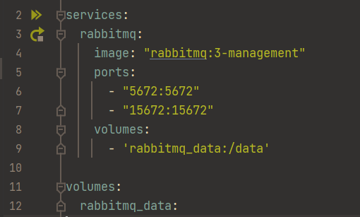

## RabbitMQ
### Usage
To run the docker-compose.yml configuration, either use `$ docker-compose up` if your environment does not support it.
If you use IntelliJ, click on the green arrow at line 2 to start all services.

After the service has started, go to `http://localhost:15672/#/` and log in with `guest` as the username and password.
